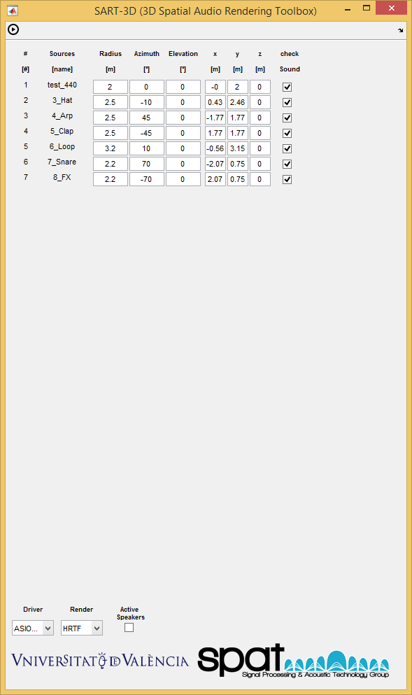
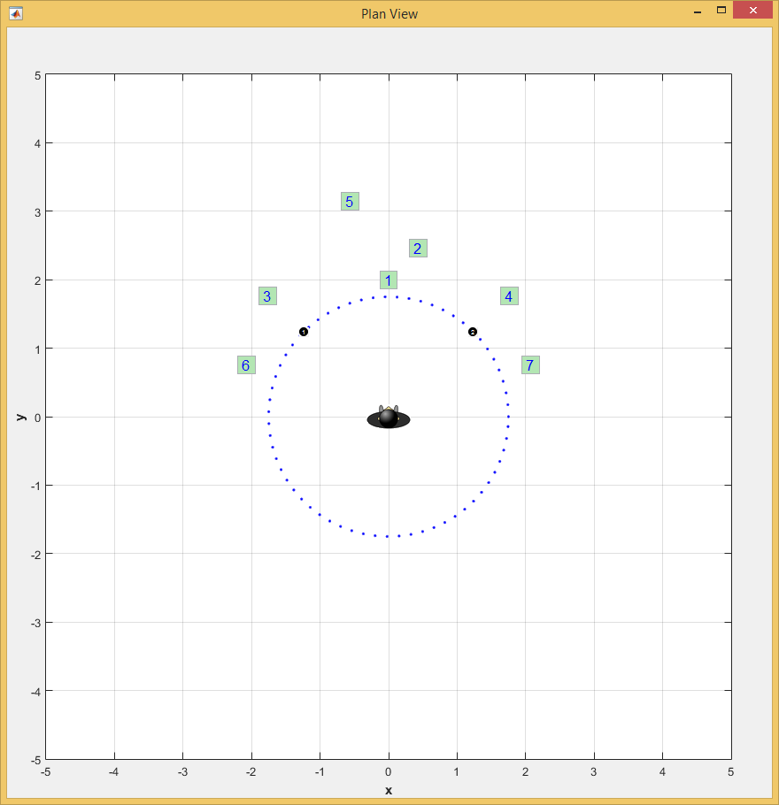
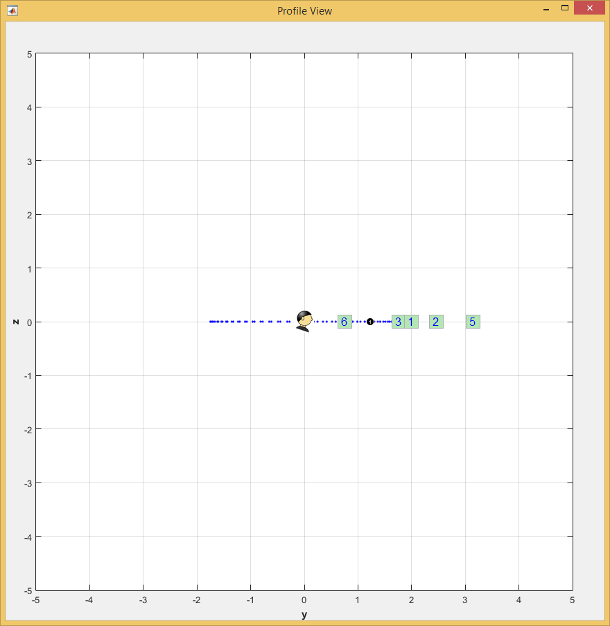
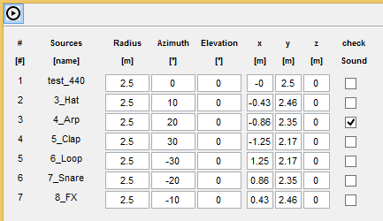
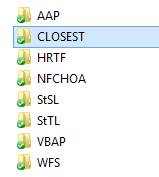

SART3D: 3D Spatial Audio Reproduction Toolbox
=============================================

### Table of Contents

**[Requirements](#requirements)**  
**[What can I do with SART3D?](#what-can-i-do-with-sart3d)**   
**[Which spatial audio rendering methods are supported?](#which-spatial-audio-rendering-methods-are-supported)**    
**[How do I give it a quick try?](#how-do-i-give-it-a-quick-try)**  
**[How can I change the set-up?](#how-can-i-change-the-setup)**   
  [Can I see an example?](#can-i-see-an-example)   
**[How do I create a new rendering method?](#how-do-i-create-a-new-rendering-method)**   
**[Credits and License](#credits-and-license)**    
**[Authors](#authors)**

Requirements
------------

* **Matlab R2013b** (or later version)
* **Signal Processing Toolbox** (Mathworks)
* **DSP System Toolbox** (Mathworks)
* **Sound Field Synthesis Toolbox** (optional, for reproducing sound field synthesis methods. Get it [here](https://github.com/sfstoolbox/sfs).)
* **Audio hardware with ASIO drivers**. If your soundcard does not have specific ASIO drivers, you can install generic [ASIO4ALL v2](http://www.asio4all.com/) drivers.
* **Core Audio drivers** for Mac users.


What can I do with SART3D?
----------------------------------

SART3D lets you move in real time virtual audio sources from a set of WAV files using multiple spatial audio rendering methods. You can specify locations of virtual sources and loudspeakers and change among the different available rendering methods.

The programmatic structure of the GUI lets the user experience with any loudspeaker setup specified in the configuration structures.
The modular design of the Toolbox lets the user create new rendering methods and experiment with different parameters. SART3D is therefore designed to be a very useful tool for spatial audio research and education.

Which spatial audio rendering methods are supported?
-----------------------------------------------------------------

Currently, the toolbox incorporates:

* VBAP (Vector Base Amplitude Panning)
* Stereo Panning Sine Law
* Stereo Panning Tangent Law
* Ambisonics Amplitude Panning
* Binaural Rendering
* Wave Field Synthesis (using the SFS Toolbox)
* Near-Field Compensated Higher Order Ambisonics (using the SFS Toolbox)


How do I give it a quick try?
---------------------------------

To start playing with SART3D, just be sure to have an available ASIO driver in your system (PC) or Core Audio (Mac).

*Step 1:* First, go to Matlab’s Preferences and set DSP System Toolbox Audio API to ASIO (or Core Audio).


*Step 2:* Then, change the current Matlab’s working folder to your SART3D folder and type: 

```Matlab
SART3Dini;
SART3D
```

This will add the folder structure into Matlab’s path and will run the main GUI (including two figure windows, one for plan view and another for profile view). The toolbox is configured to load automatically a default two-loudspeaker set-up.





*Step 3:* Check that the bottom pop-up menu contains the ASIO driver that you want to use. Here you can also select the desired rendering method. The displayed rendering methods are only the ones compatible with the specified loudspeaker setup. For example, WFS will not be available with the default two-loudspeaker setup. If you want to know how to change the setup go the next section.


*Step 4:* To start listening to a given sound source, select the ones that you want to hear using the checkboxes and push the play button in the top left corner. Drag and drop the sources to different locations or specify positions using the input edit text boxes. Stop the playback by pressing again the play button.



If you check the **Active loudspeakers** checkbox, you can see which are the active loudspeakers contributing to the rendering of a given sound source when you are moving it. For example, when using WFS with a circular loudspeaker setup you will see something like this. Note that graphics operations slow down the performance, so it is recommended to uncheck this option if you have moderate computational resources.

 

How can I change the setup?
---------------------------------

First, put your WAV files in a folder within the /audioscenes directory.

The script <code>‘gConfig.m’</code> lets the user create a valid configuration structure. Please, navigate throughout the script to create a configuration fitting your needs.

Running the <code>‘gConfig.m’</code> script results in three structures:

* **conf**: Matlab structure with general configuration parameters.
* **scene**: Matlab structure with sound scene info (source locations, files, names...)
* **setup**: Matlab structure with loudspeaker configuration (loudspeaker positions, channel mapping...)

The above structures are needed by SART3D to build the programmatic GUI. Note that once you have defined a set of valid structures, you can directly save them in a .mat file and load them directly instead of running <code>‘gConfig.m’</code>.


### Can I see an example ?

Yes, let’s create a 5 loudspeaker setup instead of the default stereo setup.
Go to <code>‘gConfig.m’</code> and specify the spherical coordinates of the loudspeakers in the **‘Loudspeaker Locations’** section:

```Matlab
% *Loudspeaker Locations*:

setup.LScoord  = {
    	[1.75, +30, 0],...
    	[1.75, 0, 0],...
		[1.75, -30, 0],...
		[1.75, -150, 0],...
		[1.75, +150, 0]};
```
Specify the correct audio channel mapping in your set-up, i.e. which audio channel in your audio interface corresponds to loudspeaker 1, which one to loudspeaker 2, etc. For example:

```Matlab
setup.ChannelMapping = [1 2 3 4 5].
```
This would tell the software that loudspeaker one is driven by the output audio channel 1, loudspeaker 2 by audio channel 2 and so on.
Save and run the <code>‘gConfig’</code> script to overwrite the <code>‘conf.mat’</code> file. Now, run again SART3D specifying the new configuration:

```Matlab
SART3D('conf.mat');
```


How do I create a new rendering method?
---------------------------------

To create a new rendering method, you have to modify some of the functions in SART3D, but the process is quite easy. 
Let us create a toy example that consists in selecting the closest loudspeaker to the virtual source. Let’s call it **CLOSEST**.

First, create a folder for the method in the /functions/algorithms directory:



Now edit <code>‘methodInit.m’</code> to let the GUI know how to initialize the method. Enter a new case for the method within the <code>switch method</code>:

```Matlab
    case 'CLOSEST'
        [methoddata,enabled] = CLOSESTstart(LSsph);
```

Create the function <code>‘CLOSESTstart.m’</code> in the CLOSEST folder. Note that de function must return two elements:

* **methoddata**: This is a tructure containing all the data needed later by the rendering method. Besides the specific data corresponding to the method, all methods are required to specify the following fields within methoddata:
	* rNLS: Required number of loudspeakers in the method (if there is any requirement).
	* L: Length of the rendering filters.
* **enabled**: This is a variable that is set to 1 or 0 depending on the availability of the method. 

Note that most initialization routines need the matrix LSsph as an input. This matrix specifies the spherical coordinates of the loudspeakers. The initialization routine of the method usually checks if the current loudspeaker setup corresponds to a valid configuration for the method, returning 0 if the loudspeaker configuration is not suitable for the rendering method.


In this toy example, the initialization script just specifies that the rendering filter is just a gain (one scalar coefficient):

```Matlab
function [CLOSESTdata, enabled] = CLOSESTstart(LSsph)

%=========================================
% CLOSEST Initialization
%=========================================

CLOSESTdata.rNLS = [];	% There is not a required number of loudspeakers

CLOSESTdata.L = 1;

enabled = 1;

% We save loudspeaker locations as accesible data to the method.
CLOSESTdata.LScar = gSph2Car(LSsph);

% The minimum loudspeaker distance will be used to normalize the gain of the rendering coefficients (to avoid saturation when the sources are very close to the listener)
CLOSESTdata.rmin = min(LSsph(1,:));
```

Now, we have to specify the function that calculates the filter coefficients and selects the contributing loudspeakers in our new method. Every rendering method must return a matrix H and a vector I. The vector I stores the indices of loudspeakers contributing to the rendering of a source at a given position. The matrix H is matrix with L rows and as many columns as the length of I, specifying the corresponding rendering filters. 

Let's define a rendering function for gCLOSEST, we will call it <code>‘gCLOSEST.m’</code>. We will need as an input for calculating the rendering function both the spherical coordinates of the source (sph) and the method data structure that we defined in the initialization function (called here CLOSESTdata)

```Matlab
function [H,I] = gCLOSEST(sph, CLOSESTdata)

sph = sph(:);
car = gSph2Car(sph);    %spherical to Cartesian coordinates

% Calculate distance to each loudspeaker
dist = sqrt((CLOSESTdata.LScar(1,:)-car(1)).^2 + (CLOSESTdata.LScar(2,:)-car(2)).^2 + (CLOSESTdata.LScar(3,:)-car(3)).^2);

% Find minimum 
[d,I] = min(dist);

% Apply distance attenuation factor
r = max(d, CLOSESTdata.rmin);
H = CLOSESTdata.rmin/r;
```

Finally, we let the general filter updating function <code>‘gRefreshH.m’</code> know the rendering function we have just created:

```Matlab
    case 'CLOSEST'
       [H, I] = gCLOSEST(coord,VS.method.data);
```

Credits and License
----------------------------------

This is the source distribution of **SART3D: 3D Spatial Audio Rendering Toolbox** licensed
under the GPLv3+. Please consult the file COPYING for more information about
this license.

Website: https://github.com/spatUV/SART3Dmaster

If you have questions, bug reports or feature requests, please use the [Issue
Section on the website](https://github.com/spatUV/SART3Dmaster/issues) to report them. 

If you use the Toolbox for your publications please cite our AES Convention paper:  
G. Moreno, M. Cobos, J. Lopez-Ballester, P. Gutierrez-Parera, J. Segura and A. M. Torres, "*On the Development of a MATLAB-based Tool for Real-time Spatial Audio Rendering*", in Proceedings of the 138th Convention of the Audio Engineering Society, Warsaw, Poland, 2015.

Copyright (c) 2011-2015   
Signal Processing and Acoustic Technology (SPAT) Group.  
Universitat de València  
Av. de la Universitat s/n, 46100, Valencia, Spain.  

Authors
------------
 
* Gabriel Moreno Ibarra
* Maximo Cobos
* Jesus Lopez-Ballester