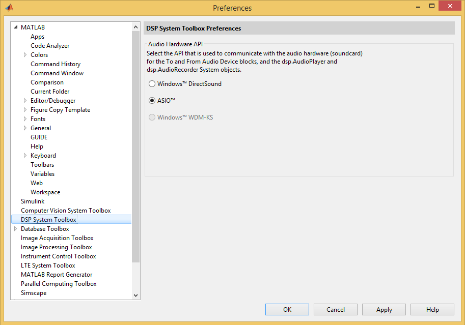
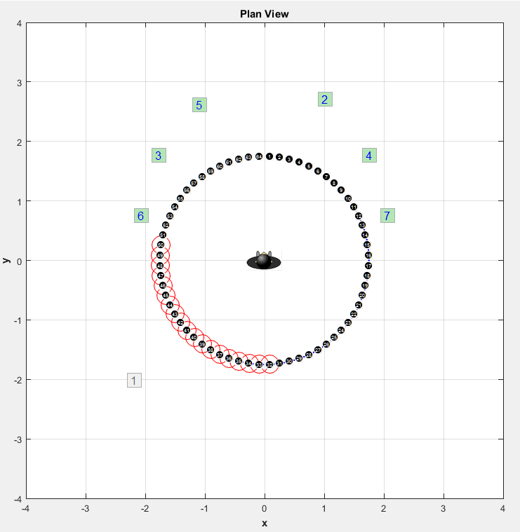
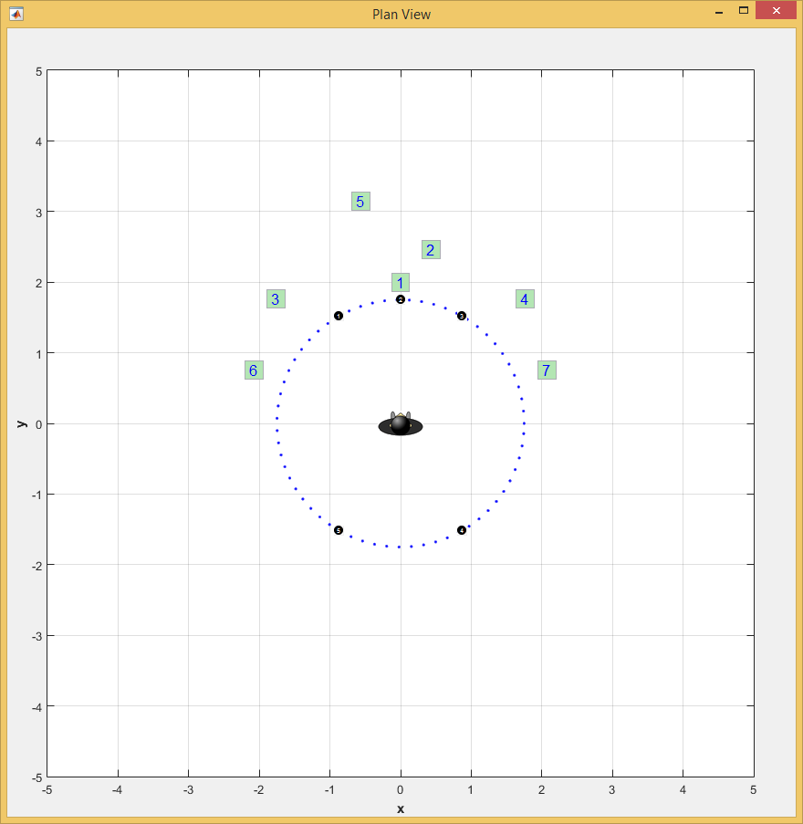

SART3D: 3D Spatial Audio Reproduction Toolbox
=============================================

### Table of Contents

**[Requirements](#requirements)**  
**[What can I do with SART3D?](#what-can-i-do-with-sart3d)**   
**[Which spatial audio rendering methods are supported?](#which-spatial-audio-rendering-methods-are-supported)**    
**[How do I give it a quick try?](#how-do-i-give-it-a-quick-try)**  
**[How can I change the set-up?](#how-can-i-change-the-setup)**   
  [Can I see an example?](#can-i-see-an-example)   
**[How do I create a new rendering method?](#how-do-i-create-a-new-rendering-method)**   
**[Credits and License](#credits-and-license)**    
**[Authors](#authors)**

Requirements
------------

* **Matlab R2013b** (or later version)
* **Signal Processing Toolbox** (Mathworks)
* **DSP System Toolbox** (Mathworks)
* **Sound Field Synthesis Toolbox** (optional, for reproducing sound field synthesis methods. Get it [here](https://github.com/sfstoolbox/sfs).)
* **Audio hardware with ASIO drivers**. If your soundcard does not have specific ASIO drivers, you can install generic [ASIO4ALL v2](http://www.asio4all.com/) drivers.


What can I do with SART3D?
----------------------------------

SART3D lets you move in real time virtual audio sources from a set of WAV files using multiple spatial audio rendering methods. You can specify locations of virtual sources and loudspeakers and change among the different available rendering methods.

The programmatic structure of the GUI lets the user experience with any loudspeaker setup specified in the configuration structure.
The modular design of the Toolbox lets the user create new rendering methods and experiment with different parameters. As a result, SART3D is a very useful tool for spatial audio research and education.

Which spatial audio rendering methods are supported?
-----------------------------------------------------------------

Currently, the toolbox incorporates:

* VBAP (Vector Base Amplitude Panning)
* Stereo Panning Sine Law
* Stereo Panning Tangent Law
* Ambisonics Amplitude Panning
* Binaural Rendering
* Wave Field Synthesis (using the SFS Toolbox)
* Near-Field Compensated Higher Order Ambisonics (using the SFS Toolbox)


How do I give it a quick try?
---------------------------------

To start playing with SART3D, just be sure to have an available ASIO driver in your system.

*Step 1:* First, go to Matlab’s Preferences and set DSP System Toolbox Audio API to ASIO.



*Step 2:* Then, change the current Matlab’s working folder to your SART3D folder and type: 

```Matlab
SART3Dini;
SART3D
```
This will add the folder structure into Matlab’s path and will run the main GUI. The toolbox is configured to load automatically a default two-loudspeaker set-up.


*Step 3:* Check that the bottom pop-up menu contains the ASIO driver that you want to use. Here you can also select the ASIO buffer size and the rendering method.


*Step 4:* To start listening to a given sound source, select the ones that you want to hear using the checkboxes and push the play button in the top left corner. Drag and drop the sources to different locations or specify positions using the input edit text boxes. Stop the playback by pressing again the play button.


Check the **Active loudspeakers" checkbox "You can see which are the active loudspeakers contributing to the rendering of a given sound source when you are moving it. For example, when using WFS with a circular loudspeaker setup you will see something like this. Note that graphics operations slow down the performance, so it is recommended to uncheck this option if you have moderate computational resources.

  

How can I change the setup?
---------------------------------

First, put your WAV files in a folder within the /audioscenes directory.

The script <code>‘gConfig.m’</code> lets the user create a valid configuration structure. Please, navigate throughout the script to create a configuration fitting your needs. You can also open the <code>‘gConfig.html’ </code> page to see a published version of the script.

Once you have modified and run ‘gConfig’ according to the desired configuration, a new <code>‘conf.mat’</code> file will be in the /configurations directory. Then, you can specify this new configuration in SART3D:

```Matlab
SART3D('conf.mat');
```
### Can I see an example ?

Yes, let’s create a 5 loudspeaker setup instead of the default stereo setup.
Go to <code>‘gConfig.m’</code> and specify the spherical coordinates of the loudspeakers in the **‘Loudspeaker Locations’** section:

```Matlab
% *Loudspeaker Locations*:
% Loudspeaker locations are defined in spherical coordinates. For example, 
% for a two-loudspeaker (or headphones) set-up: 

conf.LS.coord = {
    	[1.75, +30, 0],...
    	[1.75, 0, 0],...
[1.75, -30, 0],...
[1.75, -150, 0],...
[1.75, +150, 0]};
```
Specify the correct audio channel mapping in your set-up, i.e. which audio channel in your audio interface corresponds to loudspeaker 1, which one to loudspeaker 2, etc. By default, loudspeaker 1 goes to audio channel 1, loudspeaker 2 to channel 2, etc. However you can specify the desired mapping as follows:

```Matlab
conf.driver.ChannelMapping = [5 4 3 2 1].
```
This would tell the software that loudspeaker one is driven by the output audio channel 5, loudspeaker 2 by audio channel 4 and so on.
Save and run the <code>‘gConfig’</code> script to overwrite the <code>‘conf.mat’</code> file. Now, run again SART3D specifying the new configuration:

```Matlab
SART3D('conf.mat');
```



How do I create a new rendering method?
---------------------------------

To create a new rendering method, you have to modify some of the functions in SART3D. 
Let us create a toy example that consists in selecting the closest loudspeaker to the virtual source. Let’s call it **CLOSEST**.

First, create a folder for the method in the /algorithms directory:


Now edit <code>‘gCheckConfig.m’</code> to let the GUI know how to initialize the method. In the **‘Rendering Method Initialization’** section , enter a new case for the method within the <code>switch conf.methods.selected statement</code>:

```Matlab
case 'CLOSEST' % CLOSEST
        % ----------------------------------------------------------------
        % Initialization routine
        % ----------------------------------------------------------------
        CLOSESTstart;
```

Create the initialization script <code>‘CLOSESTstart.m’</code> in the CLOSEST folder. In this case, the initialization script just specifies that the rendering filter is just a gain (one scalar coefficient):

```Matlab
% Number of coefficients (just a gain)
conf.nCoeffs = 1;
 
% Add all the necessary parameters of the method in the conf structure (in this case, there are not any).
conf.CLOSEST = '';
```

Now, we have to specify the function that calculates the filter coefficients and selects the contributing loudspeakers in our new method. We call it <code>‘gCLOSEST.m’</code>:

```Matlab
function [H,I] = gCLOSEST(sph)
%GCLOSEST Example of Algorithm. Selects the closest loudspeaker for the
%rendering.
%
% Usage:
%   [H,I] = gCLOSEST(sph)
%
% Input parameters:
%   sph - Spherical coordinates of the virtual source [r,Az,El].
%
% Output paramters:
%   H - Gain of the selected loudspeaker.
%   I - Selected loudspeaker.
%
% See also: StSLstart, gStTL
 
global conf;
 
car = gSph2Car(sph);	%spherical to Cartesian coordinates
 
% Calculate distance to each loudspeaker
dist = sqrt((conf.LS.car(1,:)-car(1)).^2 + (conf.LS.car(2,:)-car(2)).^2 + (conf.LS.car(3,:)-car(3)).^2);

% Find minimum 
[d,I] = min(dist);
 
% Apply distance attenuation factor
r = max(d, conf.rMin);
H = conf.rMin/r;
```

We save also the above rendering function in /algorithms/CLOSEST. Then, we include in the filter updating function <code>‘gRefreshH.m’</code> the new case within the <code>switch conf.methods.selected statement</code>:

```Matlab
% INCLUDE HERE MORE CASES FOR NEW RENDERING METHODS!    
    case 'CLOSEST'
        [H,I] = gCLOSEST(data.vSSph(:,ii)); % data.VSSph(:,ii) are the spherical coords of the selected source
```
Finally, to let the user change among this method and the rest by using the pop-up menu, go to <code>‘GPopupmenu.m’</code> object and add a case for the new algorithm within the <code>switch conf.methods.names{get(handles.pmMethod, 'Value')}</code> statement:

```Matlab
                    case  'CLOSEST'
                        conf.nCoeffs = 1;
                        if isfield(conf,'CLOSEST')==0
                            CLOSESTstart;
                        end    
```

Credits and License
----------------------------------

This is the source distribution of **SART3D: 3D Spatial Audio Rendering Toolbox** licensed
under the GPLv3+. Please consult the file COPYING for more information about
this license.

Website: https://github.com/spatUV/SART3Dmaster

If you have questions, bug reports or feature requests, please use the [Issue
Section on the website](https://github.com/spatUV/SART3Dmaster/issues) to report them. 

If you use the Toolbox for your publications please cite our AES Convention paper:  
G. Moreno, M. Cobos, J. Lopez-Ballester, P. Gutierrez-Parera, J. Segura and A. M. Torres, "*On the Development of a MATLAB-based Tool for Real-time Spatial Audio Rendering*", in Proceedings of the 138th Convention of the Audio Engineering Society, Warsaw, Poland, 2015.

Copyright (c) 2011-2015   
Signal Processing and Acoustic Technology (SPAT) Group.  
Universitat de València  
Av. de la Universitat s/n, 46100, Valencia, Spain.  

Authors
------------
 
* Gabriel Moreno Ibarra
* Maximo Cobos
* Jesus Lopez-Ballester